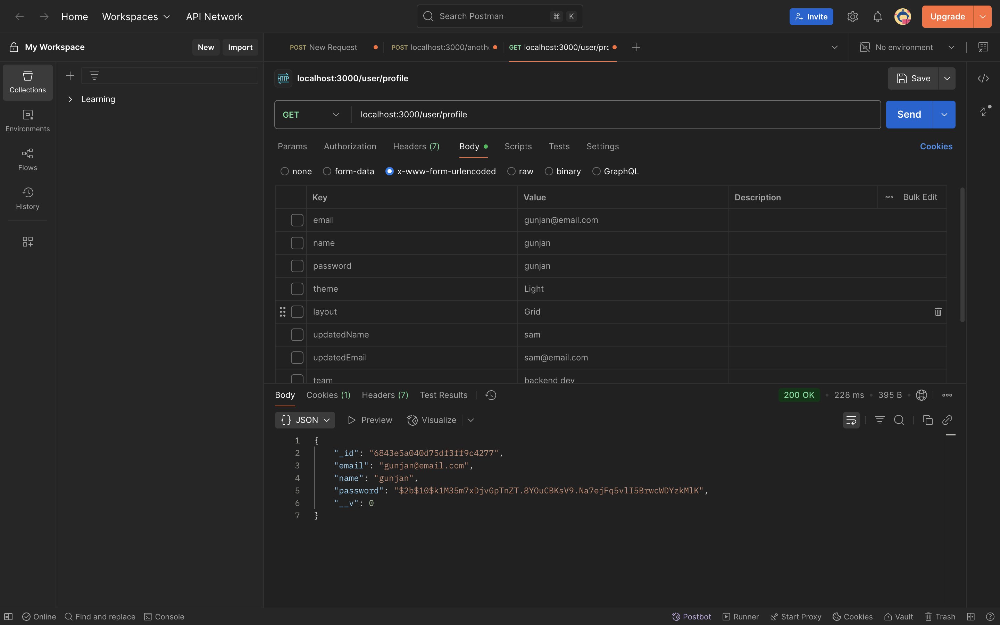
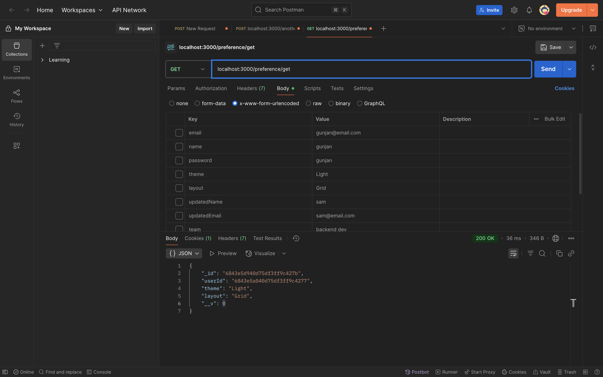
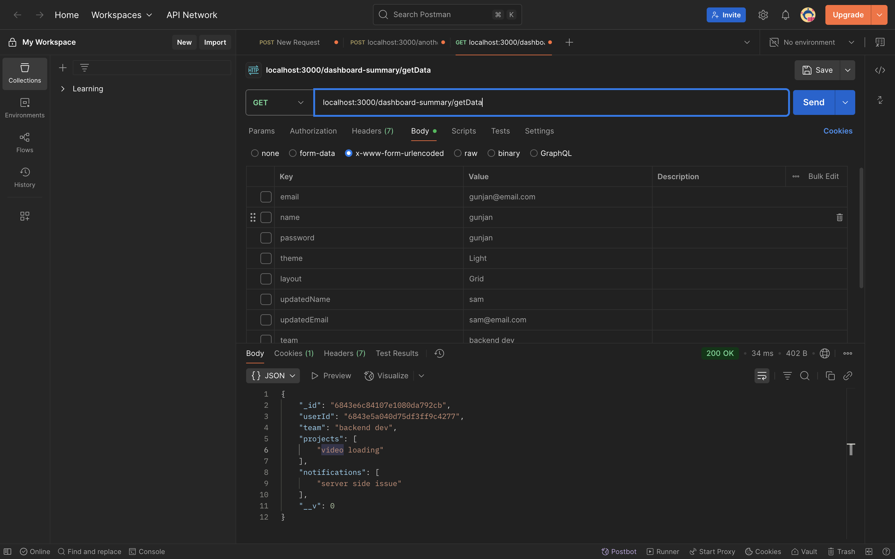

# etailedIntern
# 🧩 Backend API for User Authentication & Dashboard Preferences

This is a Node.js backend project developed as part of an internship assignment. It includes user authentication, profile management, preferences handling, and dashboard summary APIs.

## 🔧 Tech Stack

- Node.js
- Express.js
- MongoDB
- JWT for authentication
- bcrypt for password hashing

---

## 📁 Project Structure

- controllers/
- models/
- routes/
- middleware/
- app.js

---

## 🔐 Authentication & User Routes

| Method | Route       | Description                                        | Auth Required | Body                            |
|--------|-------------|----------------------------------------------------|---------------|---------------------------------|
| POST   | `/register` | Register a new user                                | ❌            | `{ name, email, password }`     |
| POST   | `/login`    | Log in a user                                      | ❌            | `{ email, password }`           |
| POST   | `/logout`   | Log out the current user                           | ✅            | `-`                             |
| GET    | `/profile`  | Get current user's profile (Procted Route)         | ✅            | `-`                             |
| PATCH  | `/profile`  | Update current user's profile                      | ✅            | `{ updatedName, updatedEmail }` |

---

## 🎛️ Preferences Routes

| Method | Route  | Description               | Auth Required | Body                |
|--------|--------|---------------------------|---------------|---------------------|
| POST   | `/set` | Save user preferences     | ✅            | `{ theme, layout }` |
| GET    | `/get` | Get saved user preferences| ✅            | `-`                 |

## 📊 Dashboard Summary Routes

| Method | Route      | Description                  | Auth Required | Body                                |
|--------|------------|------------------------------|---------------|-------------------------------------|
| POST   | `/setData` | Store dashboard summary data | ✅            | `{ team, projects, notifications }` |
| GET    | `/getData` | Fetch dashboard summary data | ✅            | `-`                                 |

---
## 🔐 JWT Middleware

The `isLoggedIn` middleware is used to protect routes that require authentication. It verifies the JWT token provided in the request header or cookie.

---

## 📲 Screenshot of working app

